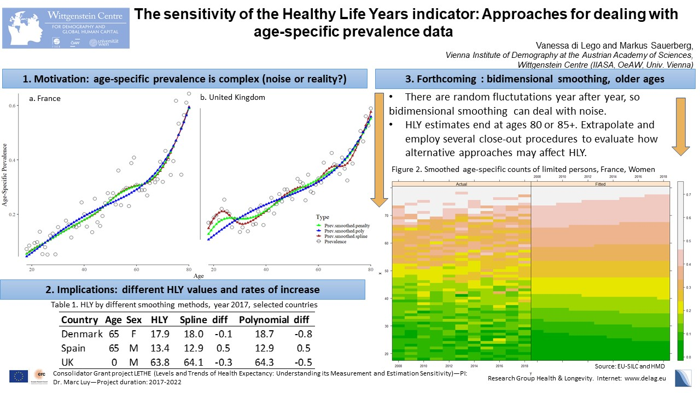

# WorkshopDemoPop

The repository contains all data, codes and info necessary to participate in the 2021 Edition of the Workshop DemoPop. We will learn how to compute lifetables, apply the Sullivan Method and test whether different smoothing methods for age-specific prevalence of disability affect the estimates. We will also learn how to use different methods to graduate mortality before joining the health data and evaluating whether any changes are observed. 
We will play around with different possibilities of data visualization as well!

