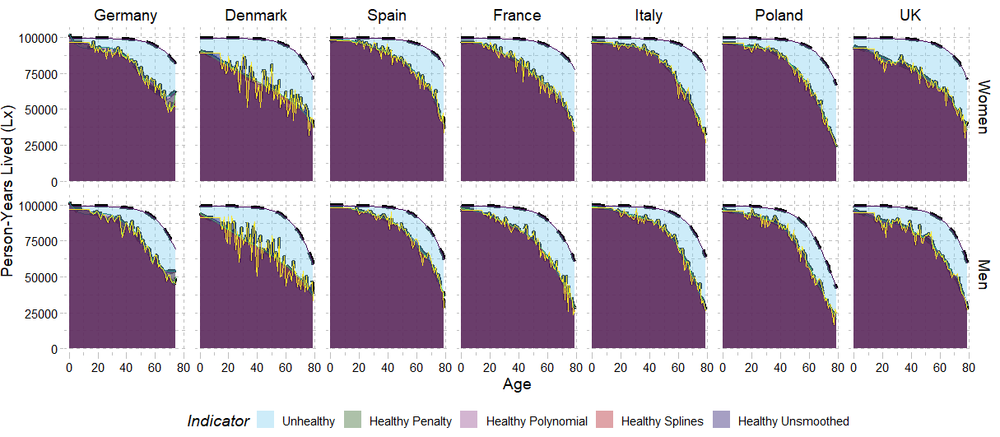

# WorkshopDemoPop

The repository contains all data, codes and info necessary to participate in the 2021 Edition of the Workshop DemoPop. We will learn how to compute lifetables, apply the Sullivan Method and test whether different smoothing methods for age-specific prevalence of disability affect the estimates. We will also learn how to use different methods to graduate mortality before joining the health data and evaluating whether any changes are observed. 
We will play around with different possibilities of data visualization as well!

There are some pages that are very helpful for those who are interested in getting into the nitty-gritty part of smoothing technique. This [**Tutorial**](https://bookdown.org/tpinto_home/Beyond-Linearity/smoothing-splines.html) and this [**Book**](https://static1.squarespace.com/static/5ff2adbe3fe4fe33db902812/t/6062a083acbfe82c7195b27d/1617076404560/ISLR%2BSeventh%2BPrinting.pdf#page=284)
are super helpful and can be very thorough. The purpose in this Workshop is not to exhaust the topic of smoothing, but its applied use for age-specific prevalence data.

We will use some functions in the [**DemoTools Package**](https://timriffe.github.io/DemoTools/) that are very helpful for handling demographic data! We will also use some implemented smoothing functions for Health Expectancy [**here**](https://patrickaubert.github.io/healthexpectancies/index.html).

For the mortality data, our exercice will focus on the [**Human Mortality Database (HMD)**](https://www.mortality.org/). It would be good if everyone registered beforehand so that we can download everything through R. If we run into any issues, I can share the mortality data in the workshop.
 

